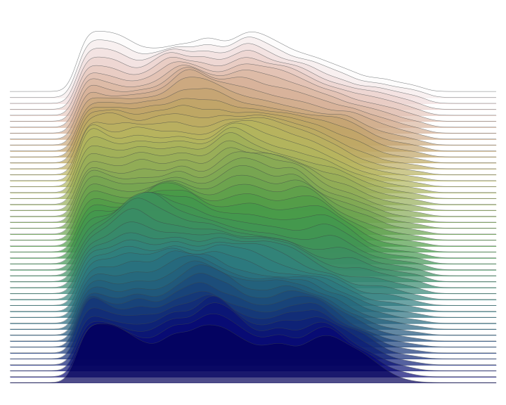

# Geography to JoyPlot

This is a little library (one function) to translate a lat-long box to a JoyPlot plot using the [joypy](https://github.com/sbebo/joypy) library and the [Google Elevation API](https://developers.google.com/maps/documentation/elevation/start).

## Installation 

```
pip install geo-joyplot
```
or 
```
git clone https://github.com/pblankley/geo-joyplot
cd geo-joyplot
python setup.py install
```

## Example

After you install the library, you can use it as follows:
```
import joypy
import matplotlib.cm as cm
import matplotlib.pyplot as plt

GOOGLE_API = '<API-KEY>'
top_left = (38.9439, -106.3746)
bot_right = (38.8253, -106.1966)

# Get the plotting pandas dataframe
plot_df = get_elev(top_left, bot_right, api_key=GOOGLE_API, n_vert=50, n_horiz=100)

# Plot with the joypy library
fig,ax = plt.subplots(figsize=(10,8))
joypy.joyplot(plot_df, by='lat_o', column='lng', \
              xlabels=False, ylabels=False, \
              colormap=cm.gist_earth_r, linewidth=0.5, alpha=0.7,\
                fill=True, linecolor='#3d4447', ax=ax, overlap=2.5);
plt.show()
```

Running this should result in the following image of the Sawatch range near Leadville, CO! 

----------------------------------------------------------------------------

<p align="center"></p>

----------------------------------------------------------------------------

Have fun, and open an issue if there are problems.
